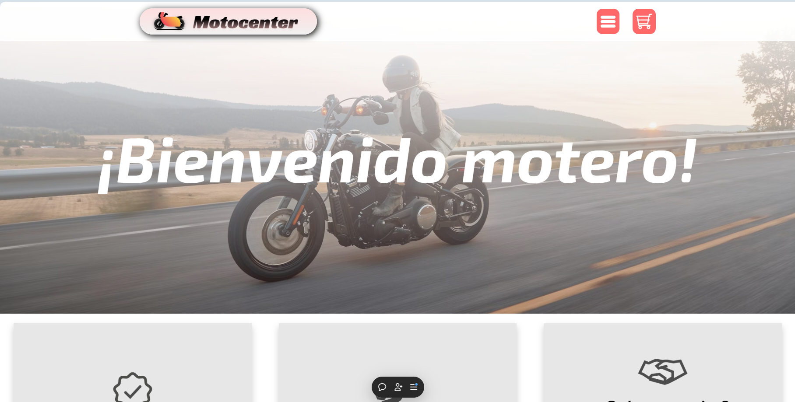
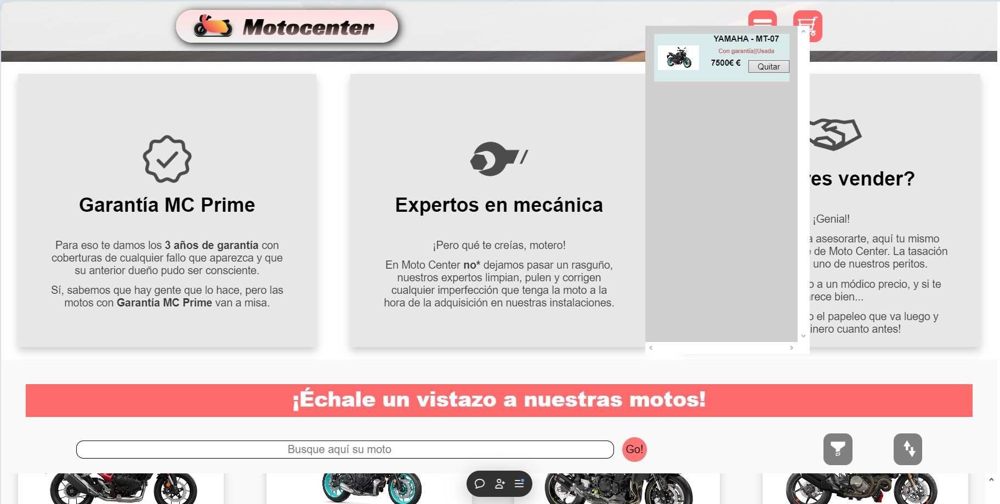
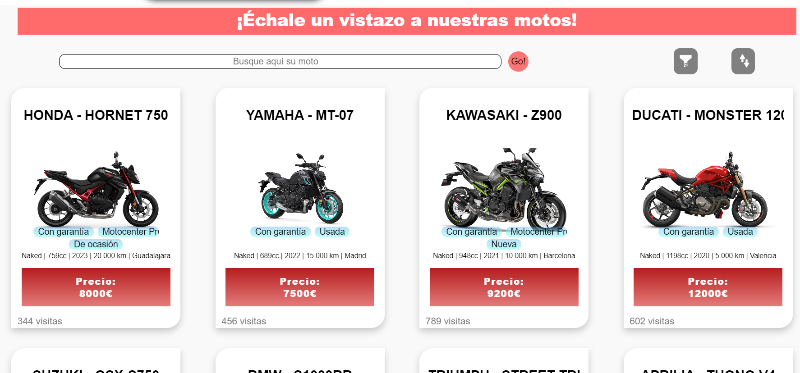
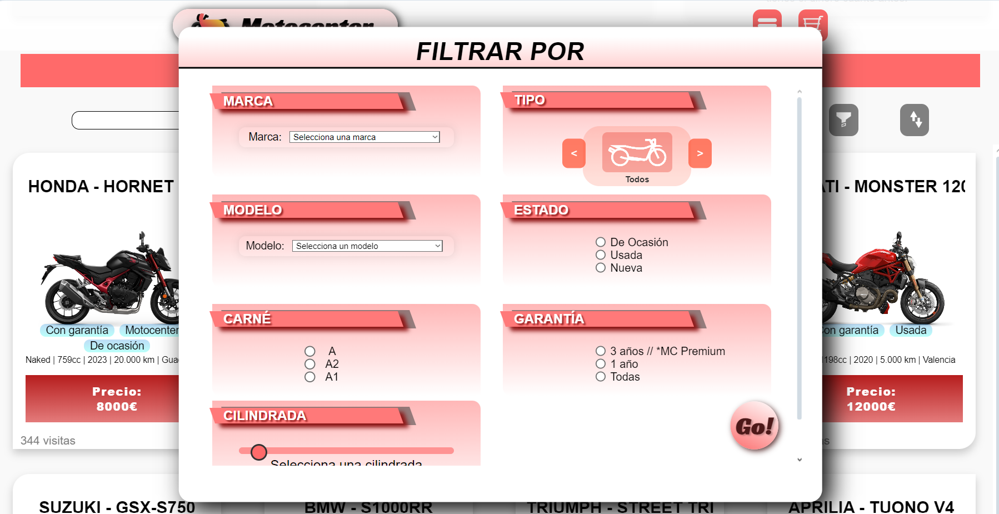

# 🏍️ Tienda de Motos - Motocenter

---

## 📑 Índice
1. [📝 Breve resumen](#-breve-resumen)
2. [🎨 Estética](#-estética)
3. [⚙️ Funcionalidad](#-funcionalidad)
4. [🧩 Bloques de HTML](#-bloques-de-html)

---

## 📝 Breve resumen

Se trata de una **tienda de motos virtual** donde el principal reto fue implementar **filtros avanzados** y resolver desafíos técnicos usando **DOM** y **CSS**.  
Las tareas más complejas incluyen:

- Implementación de filtros dinámicos.
- Creación de un carrusel dentro de los filtros.
- Desarrollo de un carrito de compra funcional.

Además de su funcionalidad, se ha prestado atención a la **estética** para ofrecer una experiencia de usuario agradable y fluida.

---

## 🎨 Estética

La estética se inspira en los colores llamativos y elegantes de marcas deportivas como **KTM** o **Rieju**, combinando un estilo **joven y dinámico**.

- **Paleta de colores**: blancos, grises suaves y acentos en tonos **rojos o naranjas intensos**.
- **Contrastes**: Combinación de bordes redondeados y afilados.
- **Sombras**: Uso delicado de sombras para resaltar elementos clave.
- **Lenguaje**: Coloquial, motivador y cercano para conectar con el usuario.

El resultado es una interfaz **limpia, moderna y atractiva**, destacando visualmente los elementos interactivos como botones o llamadas a la acción.

---

## ⚙️ Funcionalidad

La aplicación guía al usuario a través de un **cartel promocional** (*hero*) hacia la tienda principal.  

### 🔍 **Funciones principales**:
1. **Búsqueda**  
   Búsqueda rápida a través del **buscador integrado**.

2. **Filtrado**  
   Los filtros incluyen:
   - **Tipo** de moto.
   - **Marca** y **modelo**.
   - **Cilindrada**.
   - **Carné** necesario.
   - **Garantía** premium (Sí/No).
   - **Estado** de la moto (nueva/segunda mano).

   - Los filtros se activan mediante un botón que abre un **panel dinámico**.  

3. **Carrito de compra**  
   - Los elementos (motos) se agregan al carrito a través de botones en las cartas (*cards*).
   - Cada moto muestra su **precio**.
   - En el carrito, los elementos se pueden **eliminar** mediante el botón **"Quitar"**.

4. **Ordenación**  
   Las motos se pueden ordenar según:
   - Precio (de mayor a menor).
   - Precio (de menor a mayor).
   - Relevancia.

---

## 🧩 Bloques de HTML

El código está **modularizado** y organizado en secciones claras:

- **Header**: Encabezado de la página.
- **Hero**: Cartel promocional principal.
- **Sections**: Bloques de contenido funcional.
- **ShopContainer**: Sección principal con las cartas de motos.
- **Footer**: Pie de página.

---

## 🚀 Tecnologías usadas

- **HTML5**: Estructura del contenido.
- **CSS3**: Estilos y diseño visual.
- **JavaScript (DOM)**: Lógica interactiva y filtrado dinámico.
- **Vercel**: Despliegue del proyecto.

---

## 🌐 Despliegue en producción

Puedes visitar la tienda de motos desplegada aquí:  
🔗 [Enlace al despliegue en Vercel](https://vacio-aitors-projects-e5b3968f.vercel.app)

---

## 📸 Capturas de pantalla (opcional)

Si quieres, añade aquí imágenes de tu proyecto en acción para que sea más visual:

```html






